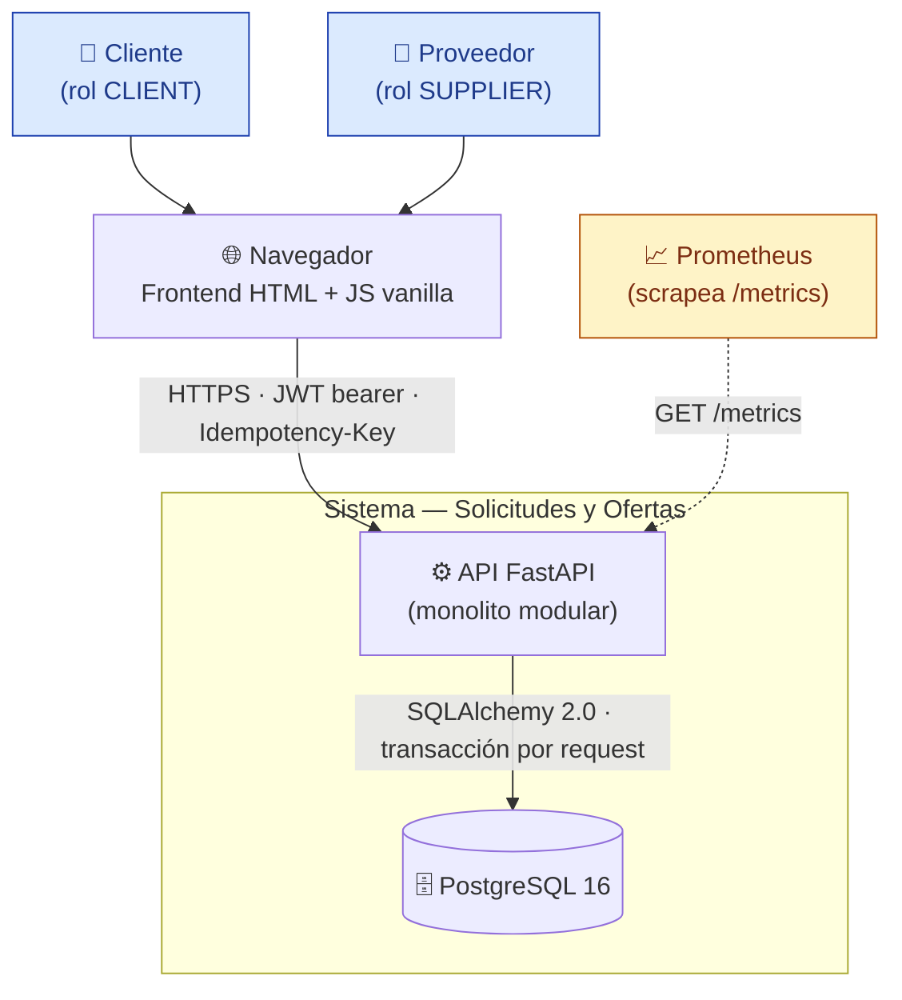
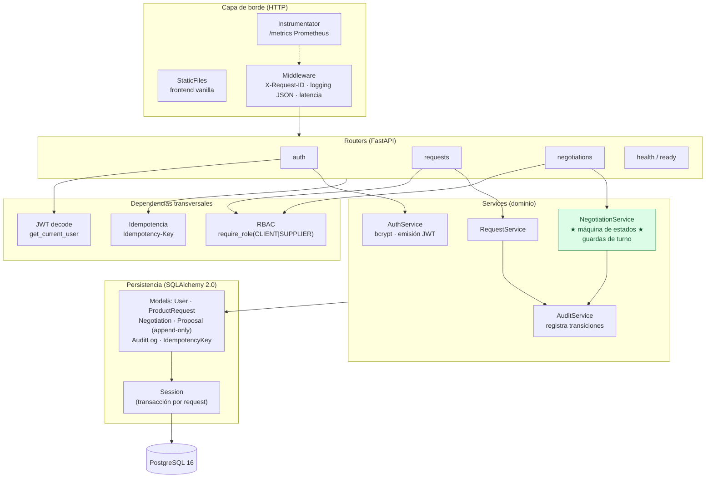

# Diagrama de contexto y componentes

Este documento muestra dos vistas complementarias: (1) el **contexto** del sistema —quién lo usa y con qué interactúa— y (2) los **componentes internos** del monolito modular y cómo se relacionan con la persistencia y la observabilidad.

## 1. Diagrama de contexto

**Lectura.** Clientes y proveedores usan un navegador que carga el frontend estático servido por la propia API (`StaticFiles`). Toda mutación viaja con un **JWT bearer** (identidad + rol) y un header **`Idempotency-Key`**. La API persiste en **PostgreSQL** con una transacción atómica por petición. **Prometheus** raspa el endpoint `/metrics` para observabilidad. No hay dependencias externas adicionales: el alcance es un único bounded context autocontenido.

## 2. Diagrama de componentes (interior de la API)

**Lectura.** El borde resuelve preocupaciones transversales (correlation id, logging, métricas, idempotencia). Los **routers** delegan en **services**; el componente central es **`NegotiationService`**, que implementa la máquina de estados y las guardas de turno (ver [maquina-estados.md](./maquina-estados.md)). Cada transición de estado se registra en `AuditService` → `audit_log`. La capa de persistencia gestiona una **transacción por request**, de modo que cada acción de negociación es atómica: o se aplica completa (cambio de estado + nueva propuesta + registro de auditoría) o se revierte por completo.
