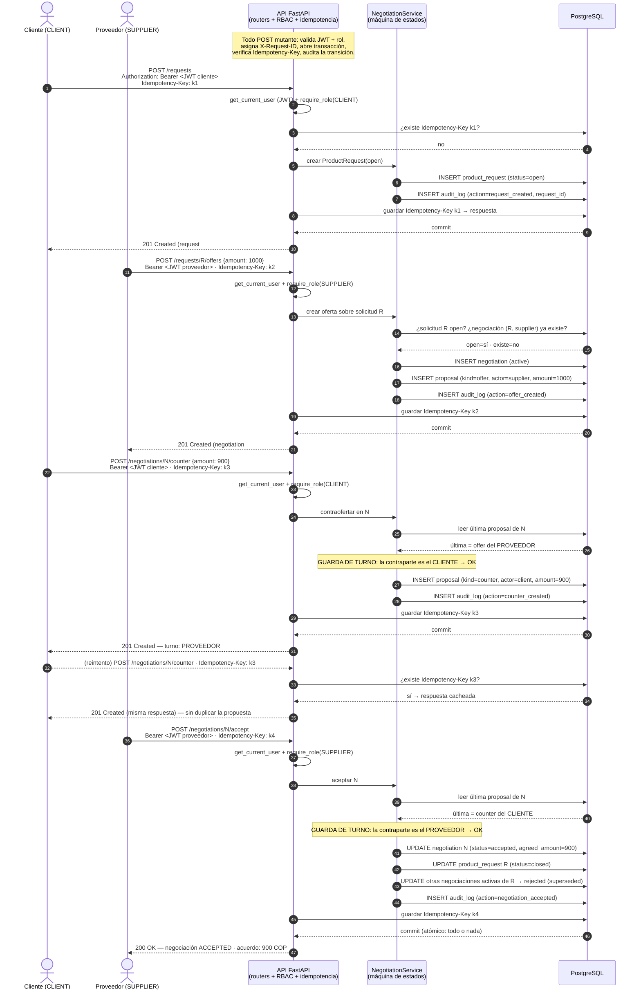

# Diagrama de secuencia — ciclo completo de negociación

Este diagrama traza un ciclo de extremo a extremo: **el cliente crea una solicitud → el proveedor oferta → el cliente contraoferta → el proveedor acepta**. Resalta los tres mecanismos de producción en el flujo: **JWT** (identidad + rol), **`Idempotency-Key`** (no duplicar mutaciones) y **`audit_log`** (trazabilidad de cada transición). Para no saturar el diagrama, los detalles transversales (correlation id `X-Request-ID`, logging JSON, transacción por request) se anotan una vez y aplican a todas las mutaciones.

## Puntos clave del flujo

- **JWT en cada paso.** El `Authorization: Bearer <JWT>` identifica al actor y su rol. La dependencia `require_role(...)` rechaza acciones del rol equivocado **antes** de tocar el dominio (403).
- **Idempotency-Key evita duplicados.** El paso del *reintento de red* sobre la contraoferta muestra el caso real: la misma `Idempotency-Key k3` no genera una segunda propuesta; se devuelve la respuesta cacheada. Esto es crítico en una negociación monetaria.
- **La guarda de turno se evalúa contra la última propuesta.** Antes de `counter` y de `accept`, el servicio lee la **última `Proposal`** y verifica que el actor sea la contraparte. Si no lo es, devuelve 409 ("no es tu turno").
- **Atomicidad de la aceptación.** Aceptar dispara varios cambios (negociación → accepted, solicitud → closed, otras negociaciones → superseded, registro de auditoría). Todos ocurren en **una sola transacción**: o se aplican juntos o se revierten juntos. No hay estados intermedios inconsistentes.
- **Trazabilidad continua.** Cada transición escribe en `audit_log` con su `request_id`, de modo que la negociación completa es reconstruible y auditable a posteriori.
