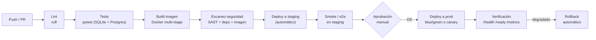

# Gestión de equipo (Punto 4)

Cómo lideraría un equipo de **2–3 desarrolladores** construyendo este sistema: organización de sprints y reparto de tareas, prácticas de revisión de código, procesos de CI/CD y temas transversales (onboarding, ADRs, deuda técnica, observabilidad/on-call, riesgos y stakeholders). El enfoque es **pragmático para un equipo pequeño**: proceso suficiente para dar calidad y predictibilidad, sin burocracia que frene a tres personas.

---

## 1. Organización de sprints y asignación de tareas

### Marco: Scrum/Kanban híbrido
Para un equipo de 2–3 personas, un **híbrido** funciona mejor que Scrum puro: **sprints de 1–2 semanas** que dan ritmo y un objetivo, pero con un **tablero Kanban** con WIP limitado para el día a día y para el trabajo no planificado (bugs, soporte). Ceremonias mínimas y de alto valor:

| Ceremonia | Frecuencia | Propósito (ajustado a equipo pequeño) |
|-----------|-----------|----------------------------------------|
| Planning | Inicio de sprint (30–60 min) | Elegir objetivo y cortar historias en tareas |
| Daily | Diario (10 min, a veces async en chat) | Sincronizar y desbloquear; no es reporte de estado |
| Review/Demo | Fin de sprint | Mostrar incremento funcionando a stakeholders |
| Retro | Fin de sprint (30 min) | 1–2 acciones de mejora concretas |
| Refinement | Continuo / a mitad de sprint | Mantener el backlog listo (1–1.5 sprints por delante) |

### Cortar el trabajo en *slices verticales*
La regla de oro: cada historia entrega una **rebanada vertical** que atraviesa todas las capas (router → service → persistencia → test → un trozo de UI), de modo que produce **valor demostrable** y evita ramas largas que integran tarde. Preferimos "el proveedor puede enviar una oferta de punta a punta" sobre "todos los modelos" + "todos los routers" + "todos los tests" como historias separadas (slices horizontales que no entregan nada usable hasta el final).

### Ejemplo de reparto de este proyecto entre 3 devs

**Sprint 0 — Cimientos (en pareja, todo el equipo).** Para evitar bloqueos por contratos compartidos, el equipo acuerda **juntos** lo transversal antes de paralelizar: estructura del proyecto, modelos SQLAlchemy y esquema, contratos Pydantic, esqueleto de auth, y los middlewares de observabilidad/idempotencia. Esto crea las "costuras" estables sobre las que cada uno trabaja sin pisarse.

**Sprints siguientes — paralelización por slices verticales:**

| Dev | Área (slices verticales) | Entregables |
|-----|--------------------------|-------------|
| **Dev A — Identidad & seguridad** | Auth y autorización | `POST /auth/register`, `/auth/login`, JWT, bcrypt, dependencias RBAC, guarda de menor privilegio, tests de seguridad |
| **Dev B — Núcleo de negociación** | Máquina de estados (el corazón) | `NegotiationService`, guardas de turno, `accept`/`reject`/`counter`, supersede, `audit_log`, tests de dominio exhaustivos |
| **Dev C — Solicitudes, frontend & plataforma** | Bordes y entorno | `requests`/`offers`, listados con paginación, frontend vanilla, Dockerfile/compose, pipeline CI, `/health` `/ready` `/metrics` |

El **núcleo de negociación (Dev B)** es lo más crítico y arriesgado: el Líder Técnico hace **pair/mob programming** en sus historias clave y revisa sus PRs con prioridad. La idempotencia y la auditoría son transversales: se diseñan en Sprint 0 y todos las respetan.

### Definición de "Done" (DoD)
Una tarea está "Done" cuando:
- [ ] Cumple los criterios de aceptación de la historia.
- [ ] Tiene **tests** (unitarios de dominio + de integración del endpoint) y pasan en CI.
- [ ] Pasa **lint** (`ruff`) y la revisión de un par (PR aprobado).
- [ ] No baja la **cobertura** acordada ni introduce *flaky tests*.
- [ ] Respeta idempotencia, auditoría y observabilidad cuando aplique.
- [ ] Documentación actualizada (README/ADR si hubo decisión relevante).
- [ ] Desplegado y verificado en **staging**.

---

## 2. Metodologías y herramientas de revisión de código

### Estrategia de ramas: trunk-based ligero
Para 2–3 devs, **trunk-based** con **ramas de vida corta** (horas o pocos días) e integración frecuente a `main`. Evita los conflictos de merge y el *integration hell* de GitFlow, que es excesivo para un equipo pequeño. Si el flujo de releases lo exigiera, se añadiría una rama `release` puntual, pero por defecto: rama corta → PR → merge → main siempre desplegable.

### Pull Requests pequeños y enfocados
- **PRs pequeños** (idealmente < 400 líneas): se revisan mejor, se entienden completos y se mergean rápido. Un PR = una intención.
- **`main` protegida** (*branch protection*): prohibido push directo; requiere **PR + al menos 1 aprobación + CI verde** para mergear.
- **CODEOWNERS**: el dueño del núcleo de negociación debe aprobar cambios en `NegotiationService`; el de seguridad, los de auth. Garantiza que un experto vea lo crítico.

### Checklist de revisión (qué mira el revisor)
1. **Correctitud**: ¿cumple los criterios? ¿maneja casos límite (estado terminal, "no es tu turno")?
2. **Seguridad**: ¿valida entrada? ¿aplica RBAC/turno? ¿secretos fuera del código? ¿sin SQL crudo?
3. **Invariantes de dominio**: ¿respeta la máquina de estados y la atomicidad transaccional?
4. **Tests**: ¿cubren el camino feliz y los errores 400/403/404/409?
5. **Legibilidad y mantenibilidad**: nombres claros, sin lógica de negocio en routers, sin duplicación.
6. **Observabilidad**: ¿registra auditoría y logs donde corresponde?

### Otras prácticas
- **Pair / mob programming** en lo más arriesgado (la máquina de estados, la idempotencia). Revisión "en vivo" que reduce defectos y comparte conocimiento.
- **Conventional Commits** (`feat:`, `fix:`, `refactor:`, `test:`…): historial legible y base para *changelogs* y versionado semántico automatizables.
- **Cultura de review respetuosa**: comentarios sobre el código, no sobre la persona; el autor responde a todo; lo no bloqueante se marca como *nit*. SLA blando: revisar PRs en < 1 día hábil para no bloquear al equipo.

---

## 3. Procesos de CI/CD

### Pipeline (extendido desde el CI actual de GitHub Actions)
El CI de la prueba ya hace `ruff` + `pytest` + build de imagen. El pipeline de producción lo extiende con *quality gates* y *deploy* gobernado:

### Quality gates
- **Lint** (`ruff`) y **formato** obligatorios.
- **Tests** verdes con umbral de **cobertura** mínimo; cero *flaky*.
- **Escaneo de seguridad**: SAST del código, auditoría de dependencias (vulnerabilidades conocidas) y escaneo de la imagen Docker. Un hallazgo crítico bloquea el merge/deploy.
- **Build** reproducible de la imagen.

### Entornos
**dev** (local con docker-compose) → **staging** (réplica de prod, datos sintéticos) → **prod**. La promoción entre entornos usa **la misma imagen** ya construida y probada (build once, deploy many): no se reconstruye por entorno, solo cambia la configuración por variables de entorno.

### Estrategia de despliegue y rollback
- **Blue/green o canary**: blue/green levanta la nueva versión en paralelo y conmuta tráfico de golpe (rollback = volver a apuntar al entorno anterior); canary expone la nueva versión a un % creciente de tráfico vigilando métricas. Para este sistema, **canary** es atractivo porque las métricas de `/metrics` permiten detectar regresión temprano.
- **Migraciones de DB**: con Alembic, **compatibles hacia atrás** (expand/contract) para que blue y green coexistan sin romper el esquema.
- **Rollback automático**: si tras el deploy las métricas (error rate, latencia, `/ready`) se degradan más allá de un umbral, el pipeline revierte solo. Como la imagen es inmutable, el rollback es volver a la imagen anterior.
- **Feature flags**: funcionalidad nueva tras un flag para desacoplar *deploy* de *release*, hacer *dark launches* y apagar algo sin un nuevo despliegue.

---

## 4. Temas adicionales relevantes

### Onboarding
- **README de arranque** ("clona → `docker-compose up` → corre en 10 minutos") y este propio directorio `Arquitectura/` como mapa mental del sistema.
- Asignar un **buddy** y una **good first issue** acotada para que el nuevo dev mergee algo en su primer par de días y aprenda el flujo de PR/CI.

### Documentación viva y ADRs
- **ADRs** (Architecture Decision Records): cada decisión arquitectónica relevante (elegir monolito modular, idempotencia por header, append-only) se registra en un ADR corto (contexto, decisión, consecuencias). Da memoria al equipo y evita revisitar debates ya cerrados. La tabla de decisiones de [Justificación.md](./Justificación.md) es el germen de esos ADRs.
- Documentación **junto al código** y revisada en los mismos PRs, para que no envejezca. OpenAPI autogenerado por FastAPI mantiene el contrato del API siempre actual.

### Gestión de deuda técnica
- Etiquetar la deuda en el backlog (`tech-debt`) y reservar una **cuota de capacidad por sprint** (p. ej. ~15–20 %) para pagarla. La deuda se hace visible y se prioriza, no se acumula en silencio. Regla del *boy scout*: dejar el código un poco mejor de como se encontró en cada PR.

### Observabilidad y on-call
- La observabilidad ya horneada (`/metrics`, logs JSON, `X-Request-ID`, `/health`, `/ready`) alimenta **dashboards y alertas** sobre SLOs (latencia, tasa de errores, disponibilidad). 
- Para 2–3 devs, una **rotación on-call ligera** con runbooks claros y *postmortems sin culpa* tras cada incidente, enfocados en mejorar el sistema, no en buscar responsables.

### Gestión de riesgos
- Identificar pronto los **riesgos del proyecto** (la corrección de la máquina de estados, la integridad de la idempotencia, la seguridad de auth) y mitigarlos con tests exhaustivos y pair programming en esas zonas. Mantener un registro de riesgos sencillo y revisarlo en la retro.

### Comunicación con stakeholders
- **Demos de fin de sprint** sobre el incremento funcionando (no slides): la mejor forma de alinear expectativas y recibir feedback temprano.
- **Transparencia del progreso**: tablero visible, objetivos de sprint claros y comunicación proactiva de bloqueos o cambios de alcance. El Líder Técnico actúa de **traductor** entre las necesidades del negocio y las decisiones técnicas, y protege al equipo del *scope creep* dentro del sprint.
