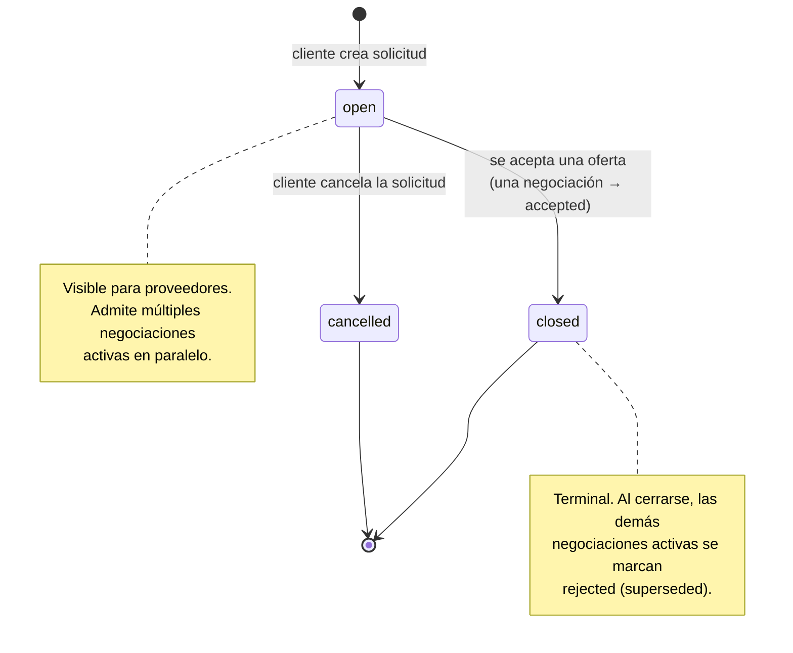
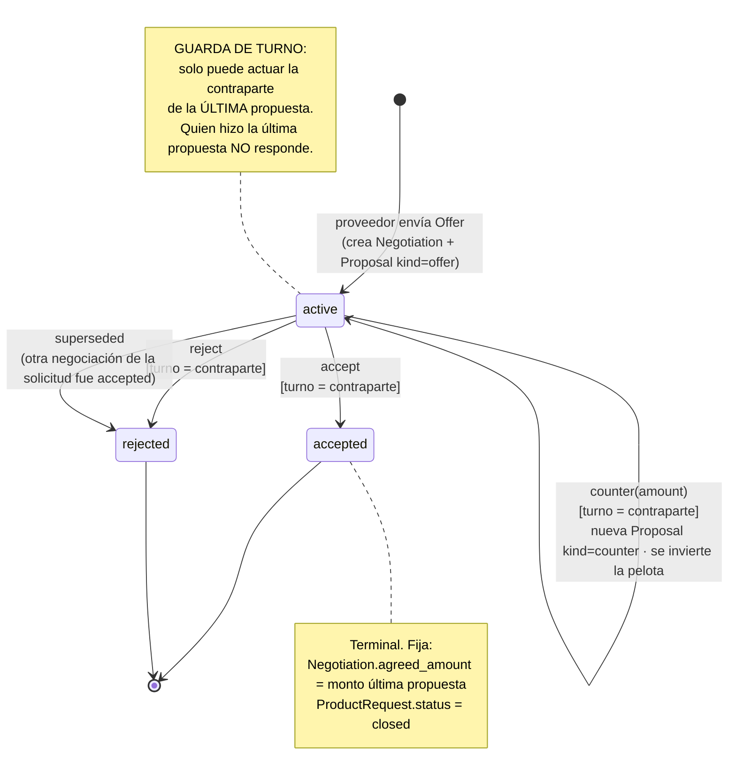

# Máquina de estados de la negociación

El corazón del sistema es una **negociación turn-based** modelada como máquina de estados. Hay dos máquinas acopladas: la de **`ProductRequest`** (el contenedor) y la de **`Negotiation`** (cada hilo proveedor↔cliente). Las guardas de turno y de estado son **invariantes de dominio** aplicadas en `NegotiationService` y respaldadas por restricciones en la base de datos.

## 1. Estados de `ProductRequest`

| Transición | Disparador | Efecto |
|------------|-----------|--------|
| `[*] → open` | Cliente crea `ProductRequest` | Queda visible para proveedores |
| `open → closed` | Se **acepta** una oferta en alguna negociación | `status=closed`; resto de negociaciones activas → `rejected` (superseded) |
| `open → cancelled` | Cliente cancela | La solicitud deja de admitir ofertas |

`closed` y `cancelled` son **terminales**.

## 2. Estados de `Negotiation`

### Transiciones y guardas

| Acción | Estado origen | Guarda | Efecto |
|--------|---------------|--------|--------|
| **Offer** (alta) | — | El actor es `SUPPLIER`; la solicitud está `open`; no existe ya negociación `(request_id, supplier_id)` | Crea `Negotiation(active)` + `Proposal(kind=offer, actor=supplier)`. La pelota queda en cancha del **cliente** |
| **counter(amount)** | `active` | El actor es la **contraparte de la última propuesta** | Nueva `Proposal(kind=counter)` del actor; sigue `active`; se **invierte el turno** |
| **accept** | `active` | El actor es la **contraparte de la última propuesta** | `Negotiation.status=accepted`; `agreed_amount = monto última propuesta`; `ProductRequest.status=closed`; **otras** negociaciones activas de esa solicitud → `rejected` (superseded) |
| **reject** | `active` | El actor es la **contraparte de la última propuesta** | `Negotiation.status=rejected`. La solicitud **sigue `open`** para otros proveedores |
| (cualquiera) | `accepted` / `rejected` | — | **Bloqueada**: no se puede actuar sobre un estado terminal |

### La guarda de turno (regla central)

En una negociación `active`, **solo la contraparte de la última propuesta puede responder**. Es decir, quien acaba de proponer **no** puede volver a actuar hasta que el otro responda. Se evalúa comparando el `actor_role`/`actor_id` de la **última `Proposal`** con el usuario autenticado:

- Si el último en proponer fue el **proveedor**, el turno es del **cliente** (puede accept / reject / counter).
- Si el último en proponer fue el **cliente**, el turno es del **proveedor** (puede accept / reject / counter).

Esto es lo que hace la negociación estrictamente **turn-based**: la "pelota" se invierte en cada `counter`.

## 3. Mapeo de errores de dominio a HTTP

Las guardas devuelven **errores de dominio** que la capa de routers traduce a códigos HTTP:

| Situación | Código | Significado |
|-----------|--------|-------------|
| Usuario sin permiso para la acción / rol incorrecto | **403 Forbidden** | RBAC o no es la contraparte de turno |
| Negociación o solicitud inexistente | **404 Not Found** | Entidad no encontrada |
| Acción sobre estado terminal, o "no es tu turno", o doble oferta | **409 Conflict** | Conflicto de estado / invariante violada |
| Payload inválido (monto ≤ 0, campos faltantes) | **400 Bad Request** | Validación Pydantic / dominio |

> Nota de diseño: "no es tu turno" y "estado terminal" se modelan como **409 Conflict** porque son conflictos con el estado actual de la máquina; la falta de rol/propiedad se modela como **403 Forbidden**. La distinción es deliberada para que el cliente del API pueda reaccionar correctamente (reintentar más tarde vs. no tiene permiso).
