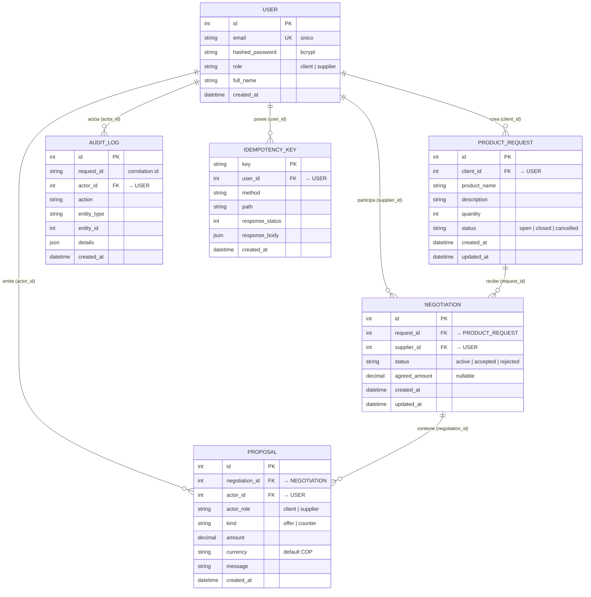

# Modelo de datos

Esquema relacional normalizado en **PostgreSQL 16**, mapeado con **SQLAlchemy 2.0**. El diseño persigue tres objetivos: **integridad por construcción** (restricciones en la base, no solo en código), **auditoría natural** (historial inmutable de propuestas + bitácora de transiciones) y **resistencia a reintentos** (claves de idempotencia).

## Diagrama entidad-relación

## Notas de diseño

### Restricciones e integridad
- **`USER.email`** es único: identidad inequívoca para login.
- **`NEGOTIATION (request_id, supplier_id)`** tiene **restricción única compuesta**: un único hilo de negociación por proveedor por solicitud. Impide que un proveedor abra dos negociaciones paralelas sobre la misma solicitud.
- Las claves foráneas garantizan integridad referencial a nivel de base, no solo en código.

### `PROPOSAL` — append-only e inmutable
La tabla de propuestas **nunca se actualiza ni se borra**: cada oferta o contraoferta es una fila nueva. El orden cronológico (`created_at` + `id`) reconstruye la negociación completa. La **última propuesta** determina de quién es el turno y, al aceptar, fija `agreed_amount`. Esto produce **auditoría natural** sin lógica adicional y elimina condiciones de carrera sobre un campo mutable de "monto actual".

### `AUDIT_LOG` — trazabilidad de transiciones
Cada transición de la máquina de estados (crear solicitud, ofertar, aceptar, rechazar, contraofertar, supersedir) escribe una fila con `actor_id`, `action`, `entity_type`/`entity_id`, `details` (JSON) y el **`request_id`** de correlación. Permite reconstruir *quién hizo qué, cuándo y en qué petición*, y cruzar la auditoría con los logs estructurados.

### `IDEMPOTENCY_KEY` — resistencia a reintentos
Clave primaria = el header `Idempotency-Key`. Guarda `method`, `path`, `response_status` y `response_body`. Ante un reintento de red, el sistema devuelve la respuesta cacheada en vez de ejecutar la mutación de nuevo. Evita ofertas o decisiones duplicadas.

### Tipos
- **`amount` / `agreed_amount`** se modelan como **`Decimal`** (no `float`) para evitar errores de redondeo en montos monetarios.
- **`currency`** por defecto `COP`; se persiste explícitamente por si el dominio crece a multimoneda.
- Las marcas temporales se almacenan en UTC.

### Evolución del esquema
En el ejercicio el esquema se inicializa con `metadata.create_all`. En **producción** se gestionaría con **migraciones Alembic**: versionadas, revisables en *code review* y reversibles, para evolucionar el esquema sin pérdida de datos ni *downtime* descontrolado.
